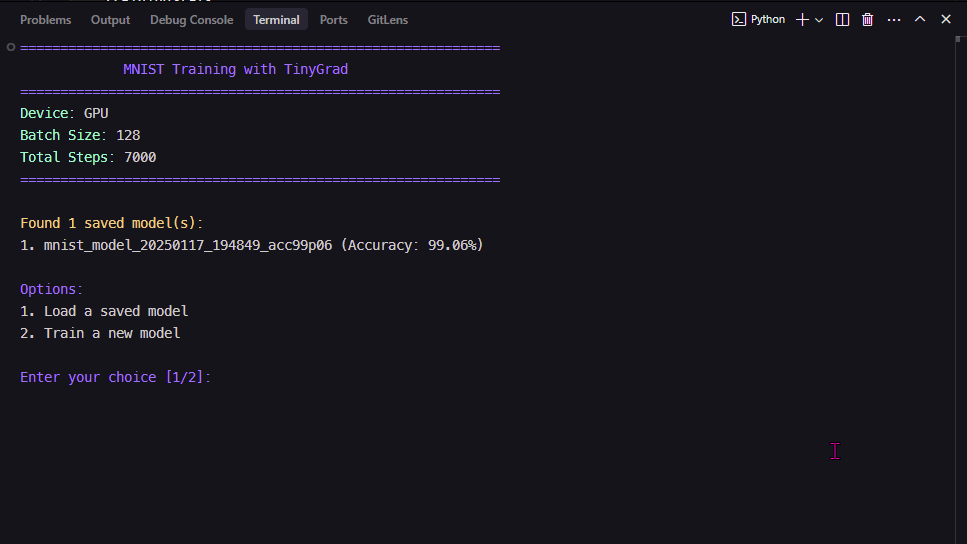

# TinyGrad MNIST Classifier

Simple MNIST digit classifier using TinyGrad with a clean terminal UI. Supports training, model saving/loading, and prediction on custom handwritten digit images.



## Project Structure

```
├── main.py        # Entry point: CLI menu, training loop, prediction flow
├── model.py       # LeNet-5 CNN architecture (Conv2d → ReLU → Pool → Linear)
├── training.py    # Training step, evaluation, save/load logic, hyperparameters
├── predict.py     # Image loading, preprocessing pipeline, prediction loop
├── data.py        # MNIST dataset loader (via tinygrad's built-in dataset)
├── display.py     # Terminal UI helpers: progress bar, colored output, cursor
├── pics/          # Place your digit images (PNG/JPG) here for prediction
└── saved_models/  # Saved model weights and metadata
```

## Installation

```bash
git clone https://github.com/alouiadel/tinygrad-mnist.git
cd tinygrad-mnist
python -m venv tiny-venv
source tiny-venv/bin/activate   # or `tiny-venv\Scripts\activate` on Windows
pip install -r requirements.txt
```

If you have a GPU, ensure tinygrad detects it (it uses Metal on Apple Silicon, CUDA on NVIDIA, or falls back to CPU).

## Quick Start

```bash
python main.py
```

The script will:

1. Check for saved models and offer to load one (or train a new one)
2. If training: load MNIST, JIT-compile the training step, train with live stats display
3. After training: optionally save the model and predict on images in `pics/`

## Model Architecture

The network is a LeNet-5 inspired CNN:

| Layer | Type     | Details                                        |
| ----- | -------- | ---------------------------------------------- |
| l1    | `Conv2d` | 1→32 channels, 3×3 kernel, ReLU, 2×2 max pool  |
| l2    | `Conv2d` | 32→64 channels, 3×3 kernel, ReLU, 2×2 max pool |
| l3    | `Linear` | 1600 → 10 (digit classes), dropout 0.5         |

Outputs logits for digits 0–9.

## Hyperparameters

| Parameter           | Value           |
| ------------------- | --------------- |
| Batch size          | 128             |
| Training steps      | 7000            |
| Evaluation interval | Every 100 steps |
| Optimizer           | Adam            |

## Image Preprocessing

Custom images (PNG/JPG) placed in `pics/` go through this pipeline before prediction:

1. Load as grayscale
2. Resize to intermediate size, normalize contrast
3. Apply Otsu thresholding (binary)
4. Crop to digit bounding box with 20% padding
5. Pad to square, resize to 28×28
6. Invert if needed (MNIST convention: white on black)
7. Convert to TinyGrad tensor (1, 1, 28, 28)

## Features

- LeNet-5 CNN for MNIST digit classification
- Terminal UI with progress bar, live loss/accuracy, colored output
- JIT-compiled training step via TinyJit
- Model save/load with safetensors and training metadata (JSON)
- Predict on custom images with confidence scores
- Batch or single image prediction
- Keyboard interrupt (Ctrl+C) safely stops training

## Dependencies

- tinygrad — neural network framework
- numpy — array operations
- opencv-python — image loading and preprocessing
- colorama — colored terminal output

## Acknowledgments

Based on the [TinyGrad MNIST tutorial](https://docs.tinygrad.org/mnist/).
